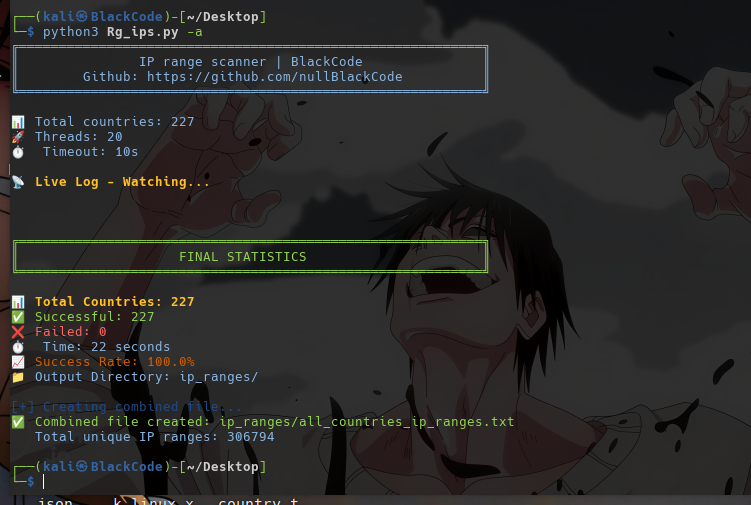
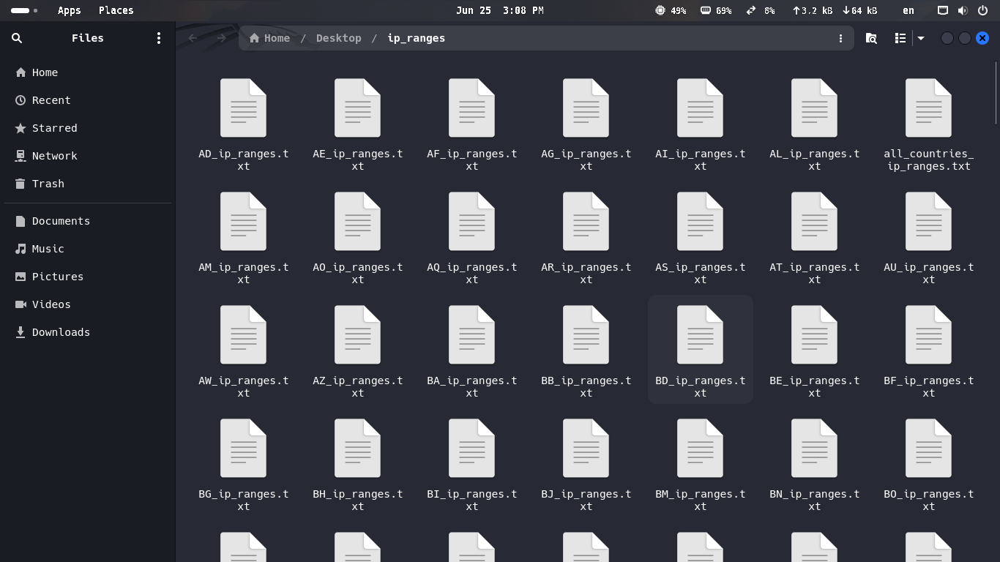
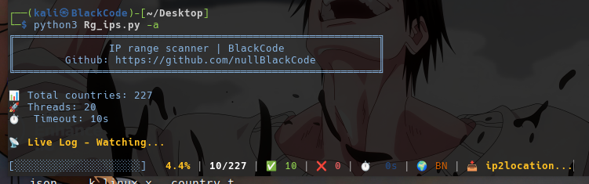

# Automatically-scan-IPs-range-
Automatic scanner and downloader tool for IPs ranges from all countries in the world, both individually and in one place.
It is written in python language and is very fast and accurate and has a very simple user interface. It puts the ranges in a folder separately by specifying a name specific to the range country.

----------

